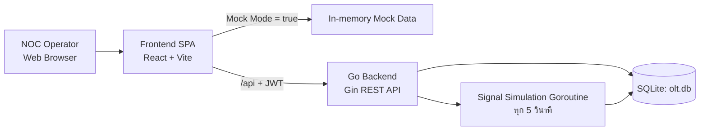
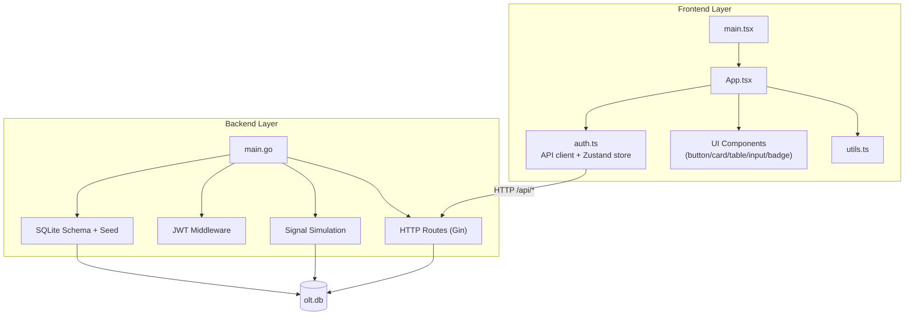
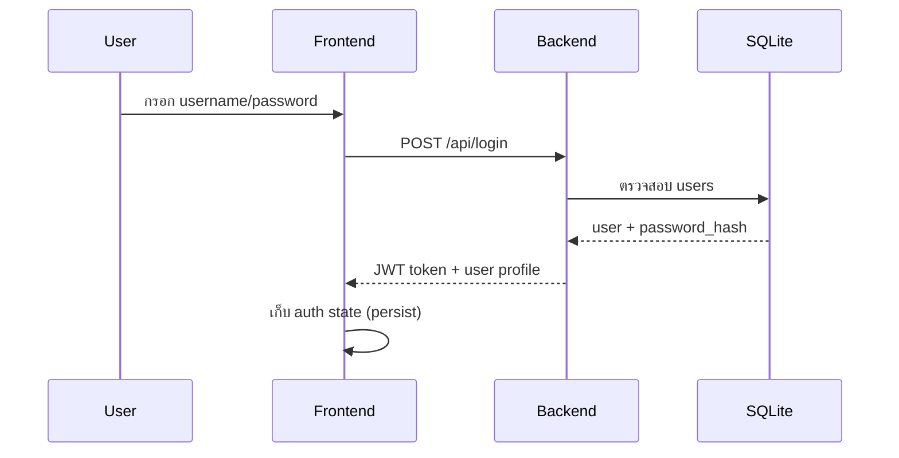
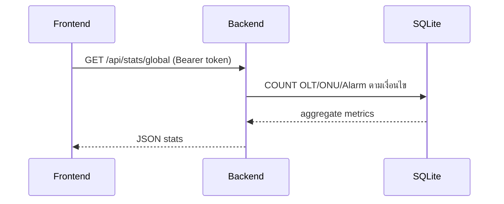
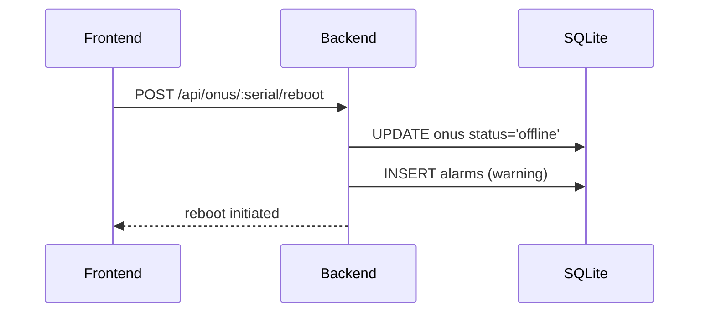

# System Architecture (As-Is from Repository)

เอกสารนี้สรุปสถาปัตยกรรมของระบบตามโค้ดจริงใน repository ปัจจุบัน (MVP แบบ monolith + SPA) เพื่อใช้อ้างอิงสำหรับทีมพัฒนา, DevOps และ NOC

## 1) Architecture Overview

ระบบแบ่งเป็น 2 ชั้นหลัก:

1. **Frontend SPA**: React + Vite + Tailwind + Zustand
2. **Backend API**: Go + Gin + JWT + SQLite

โดย Frontend เรียก REST API ผ่าน `/api/*` และรองรับ **Mock Mode** สำหรับเดโม่โดยไม่ต้องเปิด backend

## 2) Repository-level Component Map

## 3) Runtime Architecture

### 3.1 Frontend (Client-side)

- หน้า UI หลักอยู่ใน `App.tsx` และแบ่งเป็นหน้า Dashboard, OLT, ONU, Alarms, Analytics, Reports
- Auth state จัดการด้วย Zustand + persist (เก็บ token/user ใน local storage)
- API wrapper อยู่ใน `auth.ts`
- ค่า `MOCK_MODE = true` ทำให้ frontend ตอบข้อมูลจำลองเองโดยไม่เรียก backend

### 3.2 Backend (Server-side)

- รันด้วย Gin (`main.go`) เป็น REST API เซิร์ฟเวอร์เดียว
- ใช้ JWT middleware ป้องกันทุก route ใต้ `/api` (ยกเว้น `/api/login`)
- ใช้ SQLite เป็นฐานข้อมูลไฟล์เดียว (`olt.db`) โดยสร้าง schema และ seed data ตอนเริ่มระบบ
- มี goroutine จำลองสัญญาณ ONU และบันทึก signal metric ทุกช่วงเวลา

## 4) API Architecture

### Public Endpoint
- `POST /api/login`

### Protected Endpoints (ต้องมี Bearer Token)
- Dashboard: `GET /api/stats/global`
- OLT: `GET /api/olts`, `GET /api/olts/:id`
- ONU: `GET /api/onus`, `GET /api/onus/:serial`, `POST /api/onus/:serial/reboot`, `GET /api/onus/:serial/signal-history`
- Alarm: `GET /api/alarms`, `POST /api/alarms/:id/acknowledge`

## 5) Data Architecture

ตารางหลักใน SQLite:

- `users` — บัญชีผู้ใช้และ role
- `olts` — อุปกรณ์ OLT
- `onus` — ลูกข่าย ONU + สถานะ + optical level
- `alarms` — alarm active/acked
- `signal_metrics` — ประวัติสัญญาณตามเวลา

มี index สำหรับคิวรีหลัก เช่น status/severity/olt_id เพื่อช่วย query หน้า dashboard และ alarm list

## 6) Key Data Flows

### 6.1 Login Flow

### 6.2 Dashboard Flow

### 6.3 ONU Reboot Flow

## 7) Deployment View (Current MVP)

รูปแบบ deploy ที่ง่ายที่สุด:

- 1 process สำหรับ backend (`go run main.go`) บนพอร์ต 8080
- 1 process สำหรับ frontend dev server (`vite`) บนพอร์ต 5173
- DB เป็นไฟล์ local (`olt.db`) บนเครื่องเดียวกัน

> Production-ready architecture (HA, queue, metrics pipeline, microservices) ยังไม่ถูก implement ใน repo นี้ และควรเป็นเฟสถัดไป

## 8) Strengths / Risks (As-Is)

### Strengths
- โครงสร้าง MVP ชัดเจน ใช้งาน demo ได้เร็ว
- Mock Mode ช่วยพัฒนา UI โดยไม่ block backend
- มี auth + role field + alarm workflow พื้นฐาน

### Risks / Gaps
- SQLite single-file ไม่เหมาะกับ scale สูง
- ทุกอย่างรวมอยู่ใน `main.go` ทำให้ maintainability ลดลงเมื่อระบบโต
- ไม่มีแยก service สำหรับ polling/integration จริงกับอุปกรณ์ OLT
- ยังไม่มี observability stack (metrics/tracing/log aggregation) อย่างเป็นทางการ

## 9) Suggested Next Architecture Steps

1. แยก backend เป็น packages (router, handler, service, repository)
2. ย้าย SQLite -> PostgreSQL
3. แยก signal ingestion เป็น worker/service
4. เพิ่ม WebSocket/SSE สำหรับ alarm และ ONU status แบบ near real-time
5. ใส่ reverse proxy + TLS + structured logging + health/readiness checks

---

หากต้องการ ผมสามารถต่อยอดเอกสารนี้เป็นเวอร์ชัน **C4 Model (Context / Container / Component)** และทำ **deployment diagram สำหรับ Production** ให้ได้ทันที
